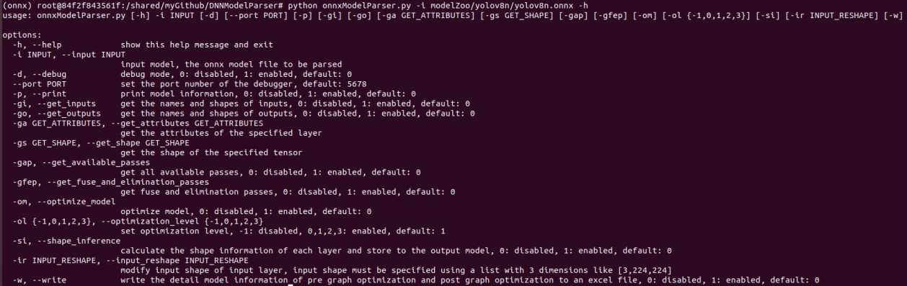
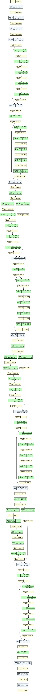

The repo uses Python to implement the parsing of DNN (Deep Neural Network) models, supporting the pre-trained models from the current popular frameworks: ONNX, Pytorch, Caffe, and TensorFlow.  

After parsing,  the detailed information of each layer is stored in an Excel file, consisting of three categories of analysis:
1. network structure analysis, including the following information:
Op Name
Kernel Shape
Input Shape
Output Shape
Padding
Stride
Dilation
2. network memory analysis, including the following information:
Kernel Mem
Output Mem
FLOPs
FLOPs Rate
3. network outliers analysis,
Kernel Nan
Kernel Inf
Kernel Max
Kernel Min
Kernel Mean
Bias Nan
Bias Inf
Bias Max
Bias Min
Bias Mean

The development environment of this project is based on Docker. Inside the Docker container, three conda virtual environments are created to provide separate environments to parse the models from the different frameworks because the different framework has different dependencies of Python packages.

To execute the Python parsing script,  follow the following steps.

1. run or attach the Docker container (the Docker image is not available now and will be provided later)
2. activate the corresponding conda virtual environment onnx/caffe/tensorflow, for example:
	```
	conda activate onnx
	```
3. run the corresponding parsing script, for example:
	```
	python onnxModelParser.py -h
	python onnxModelParser.py -i modelZoo/yolov8n/yolov8n.onnx -om -ol 1
	```
5. deactivate the corresponding conda virtual environment onnx/caffe/tensorflow.
	```
	conda deactivate onnx
	```


# ONNX

ONNX is considered as the bridge between models from different frameworks. Hence it is one of the most popular frameworks. 

So far interfaces that have been supported can be obtained by run the scrip with -h option:


A shell script demo/onnxModelParser.sh is given for reference.

The -d option is used for debugging the scripting script only inside VSCode. 
```
python onnxModelParser.py -d
```

# Pytorch

So far now, this repo supports the following functionality:
1. print the model info details
2. convert the Pytorch model to ONNX model
3. list models available in a give PyTorch Hub repository, such as pytorch/vision, ultralytics/yolov5
4. load a model from a given PyTorch Hub repository and save it
5. perform inference based on the given input data
6. print and save a summary of the Pytorch model and save it in the .txt file. For example, [resnet18_summary.txt](demo/resnet18_summary.txt)
7. visualize the given model and save the model graph in the .png file. For example, visualize the resnet18: 



